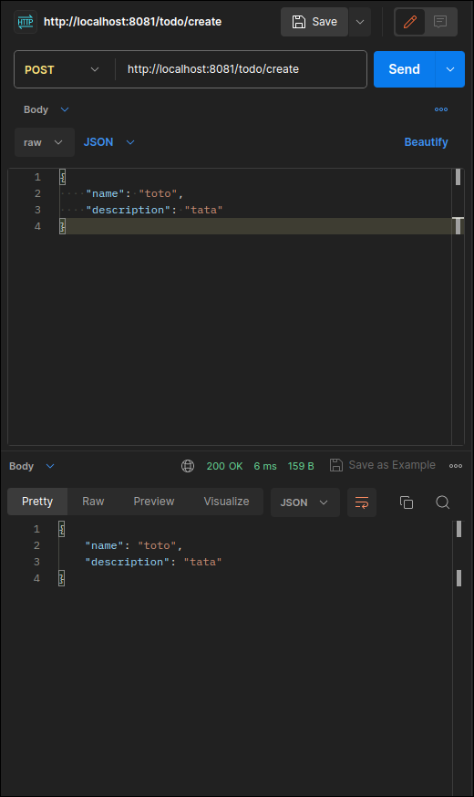
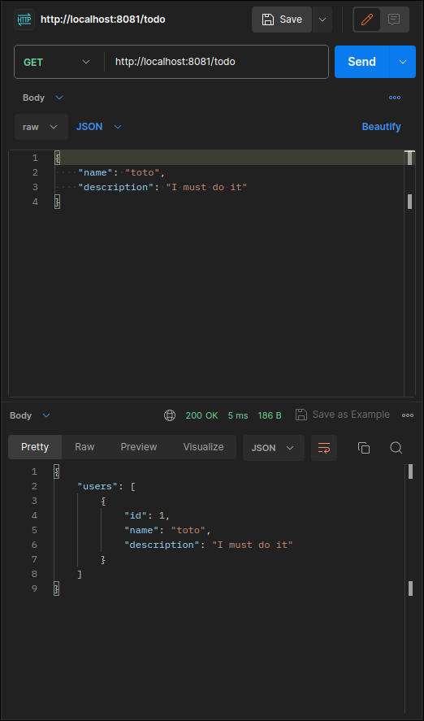

# Workshop REST API BunJS

Bun is an all-in-one toolkit for JavaScript and TypeScript apps. It ships as a single executable called bun​. The workshop will cover most of it functionnalities in order to create an API/Front Web.
#

✔️ Discover the basic features of bunjs

✔️ Learn the basics of a REST API

✔️ Read and write files in JS

> 💡 A quick [documentation](https://www.ibm.com/topics/rest-apis) about REST API

## Step 0: Install & setup bunjs

All the required information to install the workshop's dependencies are given in [SETUP.md](./SETUP.md)

## Step 1: Hello World

A starter for Bun is available. Start your project with "bun create" command.
**From the recent versions of bun you'll be asked to choose a template, youll choose the bun template of course**.

```shell
$ bun create hono my-app
```

Move into my-app and install the dependencies.

```shell
$ cd my-app
$ bun install
$ bun run dev
```
You'll be running your app in port 3000 by default but you can change it like that:

```ts
# index.ts

import { Hono } from 'hono'

const app = new Hono()

app.get('/', (c) => c.JSON({ message: 'Hello Hono!'}))

export default {
    port: 8080,         # HERE
    fetch: app.fetch,
}
```

> Try it on the browser http://localhost:8080 or on Postman

💡 Bun reads your .env files automatically and provides idiomatic ways to read and write your environment variables programmatically. So no dependencies required ! You also don't need to recompile it when things change !

```ts
import { Hono } from 'hono'

const app = new Hono()

const port = parseInt(process.env.port || 8080)

app.get('/', (c) => c.json({ message: 'Hello Hono!'}))

export default {
    port: port,         # HERE
    fetch: app.fetch,
```

## Step 2: HTTP methods

Nice job ! You created an endpoint, what you've done for now is a simple GET request that give "Hello Hono!" in json format. Let's create route to our API with a POST request on ```/todo/create```.

The todo model will only contain the following fields **name** & **description**.

```json
{
    name: "tata",
    description: "toto"
}
```

> Let's try to code properly shall we ?

💡  Here's the ideal structure you expect to have in an API:

```
project-name/
|-- src/
|   |-- controllers/
|   |   |-- userController.ts
|   |   |-- postController.ts
|   |   |-- ...
|
|   |-- models/
|   |   |-- userModel.ts
|   |   |-- postModel.ts
|   |   |-- ...
|
|   |-- routes/
|   |   |-- userRoutes.ts
|   |   |-- postRoutes.ts
|   |   |-- index.ts
|
|   |-- middleware/
|   |   |-- authentication.ts
|   |   |-- validation.ts
|   |   |-- ...
|
|   |-- services/
|   |   |-- userService.ts
|   |   |-- postService.ts
|   |   |-- ...
|
|   |-- utils/
|   |   |-- errorHandlers.ts
|   |   |-- logger.ts
|   |   |-- ...
|
|   |-- index.ts
|
|-- config/
|   |-- env.ts
|   |-- database.ts
|   |-- ...
|
|-- tests/
|   |-- userTests.ts
|   |-- postTests.ts
|   |-- ...
|
|-- .gitignore
|-- package.json
|-- README.md

```

1.  **src/**: This directory contains the source code of your application.

    **controllers/**: Contains the logic for handling different routes. Each file typically corresponds to a resource.

    **models/**: Defines the data structures of your application. Each file corresponds to a model.

    **routes/**: Defines the API routes and links them to the appropriate controllers. The index.js file is used to aggregate and export all route files.

    **middleware/**: Contains reusable middleware functions, such as authentication and validation.

    **services/**: Business logic that can be reused across controllers. Handles interactions with the models and may include additional business logic.

    **utils/**: Utility functions that can be used across the application, such as error handling and logging.

    **index.ts**: Entry point of your application where you set up Express and configure middleware.

2.  **config/**: Configuration files for your application, such as        environment-specific settings and database configurations.

    - **env.ts**: Environment-specific configurations, such as database   connection strings, API keys, etc.

    - **database.js**: Database configuration file where you set up the connection to your database.

3.  **tests/**: Contains your test files, organized by resource or feature. For example, userTests.js and postTests.js would include tests for user-related and post-related functionalities.

This is how you get values from a POST Request:

```ts
const { name, description } = await c.req.json()
```




## Step 3: Authorization middleware

Let's create an Auth middleware that will check if the user is authorized to access the endpoint ```/todo/*```.

> We won't use real token like a JWT here, but we'll rather just check if the request contains a Bearer header with a any name to it.

💡  It is fairly easy with Bun... Try to check bearerAuth :)

## Step 4: Database Interaction

Bun natively implements a high-performance SQLite3 driver. To use it import from the built-in **bun:sqlite** module.

Example:

```ts
import { Database } from "bun:sqlite";

const db = new Database(":memory:");
const query = db.query("select 'Hello world' as message;");
query.get(); // => { message: "Hello world" }
```

Try to add the Todo (that contains the name & description) to the Database in the ```/todo/create``` request

Once it is done, try to create ```/todo``` GET request that displays all the todos in the Database. Here's the code below to verify it:

```ts
app.get('/todo', (c) => {
    const stmt = db.query("SELECT * FROM name-of-your-db")
    return c.json({ users: stmt.all() })
})
```

You're expected to get this:



## Bonus

Nice job you finished the workshop !
You can go further by adding other methods to complete your database:
* a DELETE request on /todo: remove an todo from the database.
* a PUT request on /todo to update an todo.
* a POST request on /todos to create multiple todos at the same time